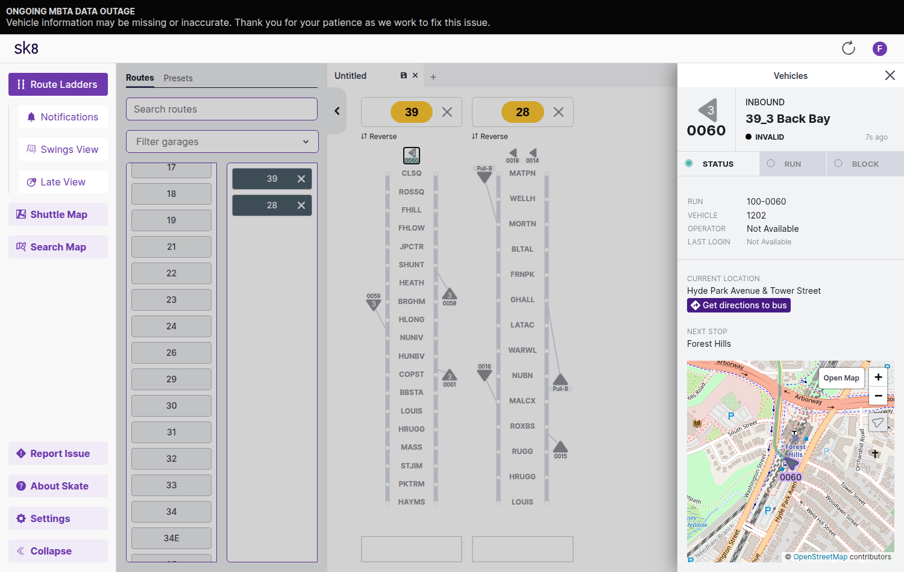

# Running Skate on public MBTA data

This branch gets Skate running locally without MBTA-internal feeds or credentials.



## What works / what doesn't

**Works:** route ladders with live buses, ghost buses, the vehicle panel, the search map (vehicles and runs), and the late view.

**Doesn't work:**
- Operator names and real run numbers. Runs are synthetic `100-xxxx` IDs, one per GTFS block.
- The "data outage" banner is always on, because Skate expects Swiftly as a second data source.
- Address search needs Amazon Location Service.
- Crowding and drawbridge alerts are unavailable.
- Swings are not meaningful with synthetic runs.

## Workarounds

1. **Synthetic schedule:** `gen_hastus.py` builds a stand-in for the internal HASTUS export (`activities.csv`, `trips.csv`) from public GTFS, with one run per block.
2. **Code patch:** in `lib/realtime/vehicle.ex`, the public enhanced feed has no `block_id` or `run_id`, so the vehicle falls back to its scheduled trip's block and run. Without this, `block_is_active` is false and every bus is hidden from the ladders.
3. **Public feeds:** `BUSLOC_URL` points at `VehiclePositions_enhanced.json`, and map tiles come from OpenStreetMap.

## Setup

Follow the main README for Elixir, Erlang, Node, and Postgres. Then:

```shell
cp local-public-data/envrc.private.example .envrc.private   # set Postgres creds (+ optional API_KEY)

mkdir -p ~/skatedata/g && cd ~/skatedata
curl -LO https://cdn.mbta.com/MBTA_GTFS.zip && unzip -o MBTA_GTFS.zip -d g
python3 /path/to/skate/local-public-data/gen_hastus.py
python3 -m http.server 8111 &        # serves hastus.zip for SKATE_HASTUS_URL
cd -

mix setup   # one data migration calls Swiftly and fails; on a fresh DB it's a no-op, so mark it done:
psql skate_dev -c "insert into schema_migrations values (20260716202203, now());"
mix ecto.migrate_all
mix phx.server
```

Open https://localhost:4000. Schedule parsing takes about 3 minutes, and route ladders stay empty until it finishes. Re-run `gen_hastus.py` whenever you download a new GTFS, then run `mix cache.clean`.
